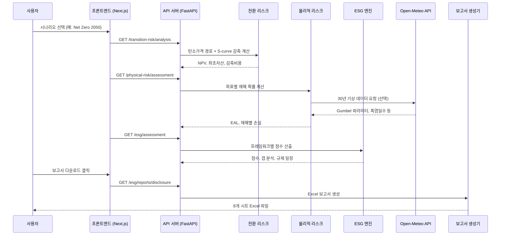
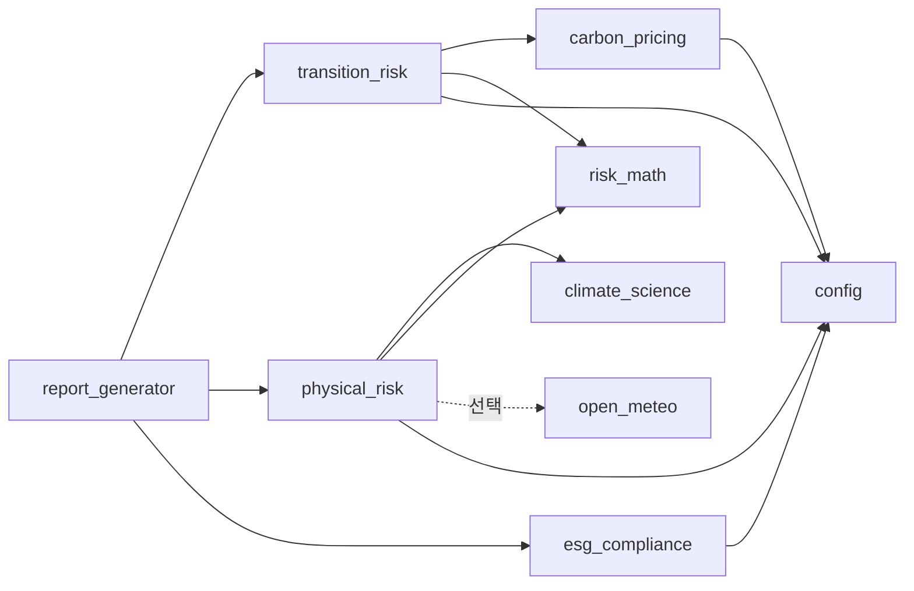
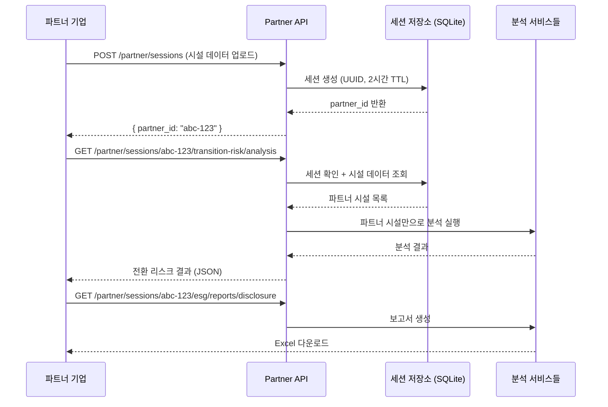

# Climate Risk Platform — 프로젝트 소개

> 이 문서는 **도메인 지식 없이도** 프로젝트 전체를 이해할 수 있도록 작성된 해설서입니다.
> 개발 환경 설정이나 API 사용법은 [README.md](README.md)를 참고하세요.

---

## 왜 이 프로젝트가 필요한가?

### 기후 공시, 선택이 아니라 의무입니다

2025년부터 한국 상장사는 기후 관련 재무 정보를 의무적으로 공시해야 합니다(KSSB). 글로벌로는 ISSB(국제지속가능성기준위원회)와 TCFD(기후관련재무정보공개태스크포스) 기준이 빠르게 확산되고 있고, 2026년에는 EU CBAM(탄소국경조정메커니즘)까지 시행됩니다.

기업 입장에서 가장 어려운 질문은 이것입니다:

> **"우리 공장의 기후 리스크가 돈으로 얼마인가?"**

탄소 가격이 오르면 비용이 얼마나 늘어나는지, 태풍이나 홍수로 공장이 멈추면 연간 손실이 얼마인지, 규제 기관이 요구하는 공시 항목을 얼마나 준비했는지 — 이런 질문에 숫자로 답해야 합니다.

### 이 플랫폼이 해결하는 문제

Climate Risk Platform은 **분석 → 평가 → 보고서 생성**을 하나의 흐름으로 처리합니다.

| 단계 | 하는 일 | 산출물 |
|------|---------|--------|
| 1. 데이터 입력 | 시설 정보(위치, 배출량, 매출) 등록 | 시설 프로필 |
| 2. 전환 리스크 분석 | 탄소가격 상승에 따른 비용 증가 계산 | NPV 기반 재무 영향 |
| 3. 물리적 리스크 분석 | 좌표 기반 자연재해 시뮬레이션 | 연간 예상 손실(EAL) |
| 4. ESG 공시 평가 | TCFD/ISSB/KSSB 기준 준비도 점수화 | 갭 분석 + 우선순위 |
| 5. 보고서 생성 | 규제 기관 제출용 Excel 자동 생성 | 8개 시트 공시 보고서 |

---

## 3분 만에 이해하는 분석 흐름

아래 다이어그램은 사용자가 분석을 요청했을 때 시스템 내부에서 일어나는 일을 보여줍니다.

### 각 단계를 쉽게 풀어보면

**1단계: 시설 데이터**
분석의 출발점은 공장 정보입니다. 위치(위도/경도), 연간 온실가스 배출량, 매출액, 자산가치 같은 기본 데이터가 필요합니다. 플랫폼에는 한국 주요 산업시설 17개가 내장되어 있고, 파트너 API를 통해 외부 기업이 자체 시설 데이터를 업로드할 수도 있습니다.

**2단계: 시나리오 선택**
NGFS(녹색금융네트워크)가 정의한 4가지 기후 시나리오 중 하나를 선택합니다. "탄소중립을 2050년까지 달성한다"(Net Zero 2050)부터 "현재 정책을 유지한다"(Current Policies)까지, 각 시나리오는 탄소 가격 경로와 온난화 정도가 다릅니다.

**3단계: 전환 리스크 계산**
비유하자면, "탄소세 고지서가 앞으로 얼마나 나올 것인가"를 계산하는 과정입니다. 기업은 배출량을 줄여나가겠지만(S-curve 감축), 탄소 가격도 동시에 오르기 때문에 순비용이 발생합니다. 여기에 설비 가치 하락(좌초자산), 공급망 비용(Scope 3), 금리 변동(WACC 조정)까지 종합해서 NPV(순현재가치)로 산출합니다.

**4단계: 물리적 리스크 계산**
비유하자면, "이 공장 위치에 태풍이 올 확률과 그때 피해액"을 계산하는 과정입니다. 홍수, 태풍, 폭염, 가뭄, 해수면 상승 5가지 재해를 각각 시뮬레이션하고, 보험 수리 방식으로 연간 예상 손실(EAL)을 산출합니다. 실제 기상 데이터(Open-Meteo)를 연동하면 정확도가 올라갑니다.

**5단계: ESG 공시 평가**
비유하자면, "규제 기관 시험에서 몇 점인지" 채점하는 과정입니다. TCFD/ISSB/KSSB 각 프레임워크 기준으로 현재 준비 상태를 1~5점 척도로 점수화하고, 부족한 항목을 영향도×난이도 기준으로 우선순위를 매깁니다.

---

## 핵심 개념 사전

처음 접하면 헷갈릴 수 있는 용어들을 정리했습니다.

### NGFS 시나리오

NGFS(Network for Greening the Financial System)는 전 세계 중앙은행과 감독기관이 만든 네트워크입니다. "기후 정책이 이렇게 진행되면 경제에 이런 영향이 있다"는 시나리오를 4가지로 정의합니다.

| 시나리오 | 의미 | 2050년 탄소가격 |
|----------|------|----------------|
| Net Zero 2050 | 적극 감축, 1.5°C 목표 | $250/tCO2e |
| Below 2°C | 점진적 감축, 2°C 목표 | $200/tCO2e |
| Delayed Transition | 뒤늦은 급격한 전환 | $180/tCO2e |
| Current Policies | 현재 정책 유지, 3°C+ | $80/tCO2e |

### 전환 리스크 vs 물리적 리스크

- **전환 리스크(Transition Risk)**: 저탄소 경제로 전환하는 과정에서 발생하는 재무 리스크. 탄소세 부과, 배출권 가격 상승, 화석연료 자산 가치 하락 등.
- **물리적 리스크(Physical Risk)**: 기후변화 자체로 인한 물리적 피해. 홍수, 태풍, 폭염, 가뭄, 해수면 상승 등.

둘은 역관계입니다 — 탄소 감축을 강하게 하면(전환 리스크↑) 온난화가 줄어들어(물리적 리스크↓) 반대도 마찬가지입니다.

### K-ETS (한국 배출권거래제)

한국 정부가 운영하는 탄소 배출권 거래 시스템입니다. 기업은 무상으로 배출권을 할당받고, 초과 배출분에 대해 시장에서 배출권을 구매해야 합니다. 이 플랫폼은 K-ETS의 무상할당 비율이 매년 줄어드는 구조(연간 축소율)를 반영합니다.

### S-curve 감축 모델

기업의 배출량 감축이 처음에는 느리다가 → 기술이 보급되면 빨라지고 → 잔여 배출에서 다시 느려지는 패턴을 모델링합니다. Bass(1969)의 혁신 확산 이론에 기반합니다. 선형 감축 대비 현실적인 경로를 제공합니다.

### EAL (Expected Annual Loss, 연간 예상 손실)

보험업계에서 사용하는 개념으로, "매년 평균적으로 얼마의 피해가 예상되는가"를 금액으로 표현합니다. 이 플랫폼은 Gumbel 극치분포(홍수), Poisson 분포(태풍) 등을 사용해 각 재해의 EAL을 산출합니다.

### TCFD / ISSB / KSSB 차이

세 가지 모두 "기후 관련 정보를 어떻게 공시하라"는 프레임워크이지만, 적용 범위가 다릅니다.

| 프레임워크 | 성격 | 핵심 |
|-----------|------|------|
| **TCFD** | 글로벌 자발적 권고 | 4개 축(거버넌스, 전략, 리스크관리, 지표·목표), 11개 권고사항 |
| **ISSB** (IFRS S2) | 글로벌 의무 기준 | TCFD 기반 + 산업별 세부 요구사항 추가 |
| **KSSB** | 한국 의무 기준 | ISSB 기반 + 한국 규제 환경 반영, 2025년부터 단계적 적용 |

---

## 기술 아키텍처 친절 가이드

### 세 줄 요약

- **백엔드(FastAPI)** = 계산기. 모든 분석 로직이 여기에 있습니다.
- **프론트엔드(Next.js)** = 대시보드. 계산 결과를 차트와 표로 보여줍니다.
- **Streamlit** = 데모. 백엔드 서비스를 직접 임포트해서 빠르게 시각화합니다.

### 서비스 레이어: 각 파일이 하는 일

백엔드의 핵심은 `backend/app/services/` 디렉토리입니다. 각 서비스의 역할을 한 문장으로 설명합니다.

| 서비스 | 한 줄 설명 |
|--------|-----------|
| `transition_risk.py` | 탄소가격이 오르면 우리 공장 비용이 얼마나 늘어나는지 계산합니다 |
| `physical_risk.py` | 이 좌표에 홍수/태풍이 올 확률과 피해액을 계산합니다 |
| `esg_compliance.py` | TCFD/ISSB/KSSB 기준으로 현재 공시 준비 상태를 점수화합니다 |
| `carbon_pricing.py` | 2024~2050년 탄소가격 경로를 생성합니다 (NGFS + K-ETS) |
| `climate_science.py` | IPCC AR6 기반으로 시나리오별 온난화 예측값을 제공합니다 |
| `risk_math.py` | NPV, WACC, Gumbel 분포 등 재무/통계 수학 도구 모음입니다 |
| `open_meteo.py` | Open-Meteo API에서 30년 기상 데이터를 가져옵니다 |
| `partner_store.py` | 파트너 기업의 세션과 시설 데이터를 SQLite로 관리합니다 |
| `report_generator.py` | 분석 결과를 규제 기관 제출용 Excel 보고서로 변환합니다 |
| `scenario_engine.py` | NGFS 시나리오 메타데이터를 조회합니다 |

### 서비스 간 의존 관계

- 실선 = 필수 의존, 점선 = 선택적 의존
- 모든 분석 서비스는 `config.py`의 시나리오·섹터 파라미터를 참조합니다
- `report_generator`는 세 분석 서비스의 결과를 조합해 Excel을 생성합니다

---

## 파트너 API 흐름

외부 기업이 자체 시설 데이터를 가지고 분석을 수행하는 흐름입니다.

핵심: 파트너 분석은 해당 세션의 시설 데이터만 사용합니다. 내장 17개 시설과 섞이지 않습니다.

---

## 자주 묻는 질문 (FAQ)

### "실제 기업 데이터인가요?"

아닙니다. 내장된 17개 시설은 한국 주요 산업(철강, 석유화학, 자동차, 반도체, 발전, 시멘트, 해운, 정유)을 반영한 **샘플 데이터**입니다. 실제 기업의 재무 정보와는 다릅니다.

### "K-ETS 탄소 가격은 어디서 오나요?"

NGFS Phase IV(2023) 시나리오의 탄소가격 경로를 기반으로, 8개 시점 보간(piecewise linear interpolation)으로 연도별 가격을 산출합니다. K-ETS 모드에서는 원화(KRW/tCO2e) 환산 경로가 적용됩니다.

### "Open-Meteo API가 안 되면 어떻게 되나요?"

자동으로 KMA(기상청) 통계 기반 폴백 값을 사용합니다. API 실패 시 경고 메시지와 함께 분석은 정상 진행됩니다. 1시간 TTL 캐시가 있어 같은 좌표의 반복 요청은 API를 호출하지 않습니다.

### "커스텀 시설 데이터를 넣으려면?"

두 가지 방법이 있습니다:

1. **파트너 API**: `POST /api/v1/partner/sessions`로 시설 데이터를 JSON으로 업로드
2. **Upload 페이지**: 프론트엔드의 `/upload` 경로에서 UI를 통해 업로드

### "보고서 형식은?"

`GET /api/v1/esg/reports/disclosure`로 Excel 파일을 다운로드합니다. 8개 시트로 구성됩니다:
- 거버넌스, 전략, 리스크 관리, 지표·목표 (TCFD/ISSB/KSSB 기준)
- 갭 분석, 규제 일정, 원시 데이터 등

### "10개 섹터 전부 지원하나요?"

내장 시설은 8개 섹터(steel, petrochemical, automotive, electronics, utilities, cement, shipping, oil_gas)를 커버합니다. 파트너 API에서는 real_estate, financial을 포함한 10개 섹터를 지원하며, 알 수 없는 섹터도 경고와 함께 기본 파라미터로 분석 가능합니다.

---

## 다음 단계

이 문서를 읽고 프로젝트가 어떤 일을 하는지 이해했다면, 다음으로 넘어가세요.

1. **코드 실행해보기**: [README.md](README.md)의 "빠른 시작" 섹션을 따라 로컬에서 실행
2. **API 탐색**: `http://localhost:8000/docs`에서 Swagger UI로 직접 엔드포인트 호출
3. **코드 기여**: 이슈를 확인하고, 브랜치를 만들고, PR을 보내주세요
4. **버그 리포트**: [GitHub Issues](https://github.com/yourusername/climate_risk/issues)에 등록

---

*이 문서에 대한 피드백이나 수정 제안은 언제든 환영합니다.*
