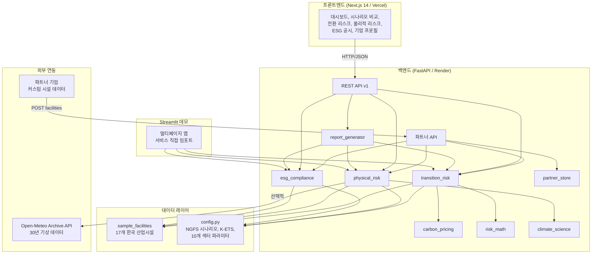

# Climate Risk Analysis Platform

[](LICENSE)
[](https://fastapi.tiangolo.com)
[](https://nextjs.org)
[](https://python.org)
[]()
[](https://render.com)
[](https://vercel.com)

> **한국 산업시설의 기후 리스크를 정량화하고, 규제 기관에 제출할 공시 보고서를 자동 생성하는 풀스택 플랫폼**

> 프로젝트가 처음이라면 [INTRODUCTION.md](INTRODUCTION.md)를 먼저 읽어보세요 — 기후 공시 배경과 분석 흐름을 친절하게 설명합니다.

---

## 한눈에 보기

<table>
<tr>
<td width="33%" valign="top">

### 전환 리스크
NGFS 4개 시나리오 × K-ETS 탄소가격 경로로 **2050년까지의 재무 영향**을 NPV로 산출합니다. S-curve 감축, 좌초자산, Scope 3 노출까지 종합 반영.

</td>
<td width="33%" valign="top">

### 물리적 리스크
홍수·태풍·폭염·가뭄·해수면 상승 5가지 재해를 좌표 기반으로 시뮬레이션합니다. Open-Meteo 30년 실측 데이터와 Gumbel 극치분포 기반.

</td>
<td width="33%" valign="top">

### ESG 공시
TCFD/ISSB/KSSB 3대 프레임워크의 공시 준비도를 자동 평가합니다. 갭 분석, 우선순위 도출, **규제 기관 제출용 Excel 보고서** 생성.

</td>
</tr>
</table>

---

## 빠른 시작

### Docker Compose (권장)

Docker가 설치되어 있다면 한 줄로 전체 플랫폼을 시작할 수 있습니다.

```bash
docker-compose up -d
```

`make up` 명령도 동일하게 동작합니다.

시작되면 아래 주소로 접근하세요:

| 서비스 | 주소 | 설명 |
|--------|------|------|
| 대시보드 (Next.js) | http://localhost:3000 | 인터랙티브 차트 기반 분석 화면 |
| API 문서 (FastAPI) | http://localhost:8000/docs | Swagger UI로 엔드포인트 직접 테스트 |
| 데모 (Streamlit) | http://localhost:8501 | 빠른 시각화 데모 |

### 수동 설치

#### 백엔드

```bash
cd backend
python -m venv venv
source venv/bin/activate        # Windows: venv\Scripts\activate
pip install -r requirements.txt
uvicorn app.main:app --reload
```

API 문서: http://localhost:8000/docs

#### 프론트엔드

```bash
cd frontend
npm install
```

`frontend/.env.local` 파일을 생성하세요:

```
NEXT_PUBLIC_API_URL=http://localhost:8000
```

```bash
npm run dev
```

대시보드: http://localhost:3000

#### Streamlit 데모

```bash
cd streamlit_app
pip install -r requirements.txt
streamlit run app.py
```

Streamlit 앱은 백엔드 서비스를 직접 임포트하므로 별도의 API 서버가 필요 없습니다.

---

## 아키텍처



| 레이어 | 기술 | 디렉토리 | 배포 |
|--------|------|----------|------|
| 백엔드 API | FastAPI + Pydantic v2 | `backend/` | Render.com |
| 프론트엔드 | Next.js 14 + Tailwind CSS | `frontend/` | Vercel |
| Streamlit 데모 | Streamlit + Plotly | `streamlit_app/` | Streamlit Cloud |

---

## 주요 기능

### 전환 리스크 분석

- **S-curve 배출 감축**: Bass(1969) 혁신 확산 모델 기반, 시나리오별 감축 경로
- **탄소가격 경로**: NGFS 8개 시점 보간(piecewise linear interpolation), 2024~2050
- **K-ETS 무상할당**: 섹터별 기본 할당률 + 연간 축소율 반영
- **좌초자산**: 유틸리티·정유 섹터 설비 가치 하락 (Carbon Tracker 2023)
- **Scope 3 노출**: CDP(2023) 기반 공급망 배출 비용
- **WACC 조정**: 시나리오별 신용 스프레드 반영 (Battiston et al. 2017)
- **한계감축비용**: 섹터별 기술 학습률 적용 MAC 곡선

### 물리적 리스크 분석

- **홍수**: Gumbel Type I 극치분포 + USACE 침수심-피해 함수
- **태풍**: Poisson 빈도 × HAZUS-MH 풍속-피해 곡선
- **폭염/가뭄**: IPCC AR6 WG1 Ch.11 스케일링, ILO 생산성 손실
- **해수면 상승**: IPCC AR6 WG1 Ch.9 전망
- **사업 중단**: Munich Re/Swiss Re 기반 간접 손실
- **복합 리스크**: 분산-공분산 기반 재해 간 상관 반영
- **Open-Meteo 연동**: 좌표별 30년 기상 데이터로 Gumbel 파라미터 도출 (선택)

### ESG 공시 엔진

- **3대 프레임워크**: TCFD(4축 11권고), ISSB(IFRS S2), KSSB
- **성숙도 점수**: 1~5점 척도, 가중 카테고리 집계
- **갭 분석**: 영향도×난이도 기반 우선순위
- **규제 일정 추적**: KSSB 2025, EU CBAM 2026, KSSB 전면 적용 2027
- **Excel 보고서 생성**: 8개 시트 규제 기관 제출용

### 파트너 API

- 외부 기업이 시설 데이터를 업로드하고 동일한 분석을 수행
- UUID 기반 세션 관리 (2시간 TTL)
- 10개 섹터 지원, 미등록 섹터는 경고와 함께 기본값 적용
- 13개 엔드포인트: 세션 CRUD + 분석 + 보고서 다운로드

### 데이터 커버리지

- 17개 한국 산업시설 (8개 섹터) 내장
- 10개 섹터 파라미터 (steel, petrochemical, cement, utilities, oil_gas, shipping, automotive, electronics, real_estate, financial)
- Open-Meteo 30년 기상 데이터, 1시간 TTL 캐시

---

## NGFS 시나리오

| 시나리오 | 온난화 경로 | 2030 탄소가격 (USD) | 2050 탄소가격 (USD) | 감축 목표 |
|----------|-----------|-------------------|-------------------|----------|
| Net Zero 2050 | 1.5°C | $130 | $250 | 50% |
| Below 2°C | ~2°C | $100 | $200 | 40% |
| Delayed Transition | ~2.5°C (지연 후 급격) | $90 | $180 | 30% |
| Current Policies | 3°C+ | $40 | $80 | 15% |

K-ETS 가격 경로(KRW/tCO2e)는 `pricing_regime=kets` 파라미터로 사용할 수 있습니다. 무상할당 비율은 섹터별로 매년 축소됩니다 (예: 철강 97% 기본 할당, 연 1.0%p 감소).

---

## API 레퍼런스

기본 URL: `/api/v1` — Swagger UI: `/docs`

### 핵심 엔드포인트

| 메서드 | 경로 | 설명 | 주요 파라미터 |
|--------|------|------|-------------|
| GET | `/api/v1/scenarios` | NGFS 시나리오 목록 조회 | — |
| GET | `/api/v1/scenarios/{scenario_id}` | 시나리오 상세 조회 | `scenario_id`: path |
| GET | `/api/v1/company/facilities` | 시설 목록 조회 | `sector` (선택) |
| GET | `/api/v1/company/facilities/{facility_id}` | 시설 상세 조회 | `facility_id`: path |
| GET | `/api/v1/company/sectors` | 섹터 목록 조회 | — |
| GET | `/api/v1/transition-risk/analysis` | 전환 리스크 분석 | `scenario`, `pricing_regime` |
| GET | `/api/v1/transition-risk/summary` | 전환 리스크 요약 | `scenario`, `pricing_regime` |
| GET | `/api/v1/transition-risk/comparison` | 시나리오 간 비교 | `pricing_regime` |
| GET | `/api/v1/physical-risk/assessment` | 물리적 리스크 평가 | `scenario`, `year`, `use_api_data` |
| POST | `/api/v1/physical-risk/simulate` | 커스텀 시설 물리적 리스크 시뮬레이션 | body: `{scenario, year, use_api_data, facilities}` |
| GET | `/api/v1/esg/assessment` | ESG 공시 평가 | `framework` |
| GET | `/api/v1/esg/disclosure-data` | ESG 공시 상세 데이터 | `framework` |
| GET | `/api/v1/esg/reports/disclosure` | 공시 보고서 다운로드 (Excel) | `framework`, `scenario`, `pricing_regime`, `year` |
| GET | `/api/v1/esg/frameworks` | ESG 프레임워크 목록 | — |
| GET | `/health` | 헬스 체크 | — |

### 파트너 API 엔드포인트

| 메서드 | 경로 | 설명 |
|--------|------|------|
| POST | `/api/v1/partner/sessions` | 파트너 세션 생성 (시설 데이터 업로드) |
| GET | `/api/v1/partner/sessions/{partner_id}` | 세션 정보 조회 |
| DELETE | `/api/v1/partner/sessions/{partner_id}` | 세션 삭제 |
| GET | `/api/v1/partner/sessions/{pid}/facilities` | 파트너 시설 목록 |
| GET | `/api/v1/partner/sessions/{pid}/transition-risk/analysis` | 전환 리스크 분석 |
| GET | `/api/v1/partner/sessions/{pid}/transition-risk/summary` | 전환 리스크 요약 |
| GET | `/api/v1/partner/sessions/{pid}/transition-risk/comparison` | 시나리오 비교 |
| GET | `/api/v1/partner/sessions/{pid}/physical-risk/assessment` | 물리적 리스크 평가 |
| POST | `/api/v1/partner/sessions/{pid}/physical-risk/simulate` | 물리적 리스크 시뮬레이션 |
| GET | `/api/v1/partner/sessions/{pid}/esg/assessment` | ESG 평가 |
| GET | `/api/v1/partner/sessions/{pid}/esg/disclosure-data` | ESG 공시 데이터 |
| GET | `/api/v1/partner/sessions/{pid}/esg/reports/disclosure` | 공시 보고서 다운로드 |

### 파라미터 참조

| 파라미터 | 값 | 기본값 |
|---------|-----|-------|
| `scenario` | `net_zero_2050`, `below_2c`, `delayed_transition`, `current_policies` | `net_zero_2050` |
| `pricing_regime` | `global`, `kets` | `global` |
| `framework` | `tcfd`, `issb`, `kssb` | `tcfd` |
| `year` | `2025`~`2100` | 시나리오 기본값 |
| `use_api_data` | `true`, `false` | `false` |

### 요청 예시

K-ETS 적용 전환 리스크:

```bash
curl "http://localhost:8000/api/v1/transition-risk/analysis?scenario=net_zero_2050&pricing_regime=kets"
```

2040년 Open-Meteo 연동 물리적 리스크:

```bash
curl "http://localhost:8000/api/v1/physical-risk/assessment?scenario=below_2c&year=2040&use_api_data=true"
```

KSSB 기준 ESG 평가:

```bash
curl "http://localhost:8000/api/v1/esg/assessment?framework=kssb"
```

공시 보고서 다운로드:

```bash
curl -O "http://localhost:8000/api/v1/esg/reports/disclosure?framework=kssb&scenario=net_zero_2050"
```

파트너 API — 세션 생성 및 분석:

```bash
# 1. 세션 생성
curl -X POST "http://localhost:8000/api/v1/partner/sessions" \
  -H "Content-Type: application/json" \
  -d '{
    "company_name": "ABC Corp",
    "facilities": [{
      "facility_id": "F001",
      "name": "ABC Steel Plant",
      "company": "ABC Corp",
      "sector": "steel",
      "latitude": 35.5,
      "longitude": 129.0,
      "current_emissions_scope1": 500000,
      "current_emissions_scope2": 200000,
      "annual_revenue": 800000000,
      "ebitda": 80000000,
      "assets_value": 1200000000
    }]
  }'

# 응답: { "partner_id": "uuid-xxx", ... }

# 2. 전환 리스크 분석
curl "http://localhost:8000/api/v1/partner/sessions/{uuid-xxx}/transition-risk/analysis?scenario=net_zero_2050"

# 3. 공시 보고서 다운로드
curl -O "http://localhost:8000/api/v1/partner/sessions/{uuid-xxx}/esg/reports/disclosure"
```

---

## 프로젝트 구조

```
climate_risk/
├── backend/
│   ├── app/
│   │   ├── main.py                  # FastAPI 진입점, CORS, 라우터 등록
│   │   ├── api/v1/
│   │   │   ├── transition.py        # /transition-risk 엔드포인트
│   │   │   ├── physical.py          # /physical-risk 엔드포인트
│   │   │   ├── esg.py               # /esg 엔드포인트
│   │   │   ├── scenarios.py         # /scenarios 엔드포인트
│   │   │   ├── company.py           # /company 엔드포인트
│   │   │   └── partner.py           # /partner 엔드포인트 (파트너 API)
│   │   ├── services/
│   │   │   ├── transition_risk.py   # S-curve 감축, NPV, 좌초자산
│   │   │   ├── physical_risk.py     # Gumbel 홍수, Poisson 태풍, EAL
│   │   │   ├── esg_compliance.py    # TCFD/ISSB/KSSB 점수화 엔진
│   │   │   ├── carbon_pricing.py    # NGFS 가격 경로, K-ETS 무상할당
│   │   │   ├── risk_math.py         # WACC, NPV, 할인율 유틸리티
│   │   │   ├── climate_science.py   # 온난화 전망, 해수면 상승
│   │   │   ├── open_meteo.py        # 30년 기상 데이터 API 클라이언트
│   │   │   ├── partner_store.py     # SQLite 파트너 세션 저장소
│   │   │   ├── report_generator.py  # Excel 공시 보고서 생성기
│   │   │   └── scenario_engine.py   # 시나리오 메타데이터 조회
│   │   ├── models/
│   │   │   └── schemas.py           # Pydantic v2 요청/응답 모델
│   │   ├── core/
│   │   │   └── config.py            # 시나리오, 10개 섹터 파라미터, 학술 근거
│   │   ├── data/
│   │   │   └── sample_facilities.py # 17개 한국 산업시설 데이터
│   │   └── tests/
│   │       ├── test_services.py     # 서비스 단위 테스트 (61개)
│   │       └── test_partner_api.py  # 파트너 API 통합 테스트 (19개)
│   ├── requirements.txt
│   ├── Dockerfile
│   └── render.yaml                  # Render.com 배포 설정
├── frontend/
│   ├── src/
│   │   ├── app/                     # Next.js App Router 페이지
│   │   ├── components/              # 레이아웃, 차트, 테이블, ESG 컴포넌트
│   │   ├── lib/                     # API 클라이언트, 유틸리티
│   │   └── hooks/                   # 데이터 페칭 훅 (SWR)
│   ├── package.json
│   ├── Dockerfile
│   └── tailwind.config.ts
├── streamlit_app/
│   ├── app.py                       # 대시보드 진입점
│   ├── pages/                       # 멀티페이지 Streamlit 뷰
│   ├── utils/                       # 포매팅 헬퍼
│   ├── requirements.txt
│   └── Dockerfile
├── docker-compose.yml               # 원클릭 실행 (3개 서비스)
├── Makefile                         # Docker 명령 단축키
├── INTRODUCTION.md                  # 프로젝트 해설서
└── README.md                        # 이 문서
```

---

## 프론트엔드 페이지

| 페이지 | 경로 | 설명 |
|--------|------|------|
| 대시보드 | `/` | KPI 카드, 시설 지도, 배출량 개요 |
| 기업 프로필 | `/company-profile` | 시설 인벤토리, 매출, Scope별 배출량 |
| 전환 리스크 | `/transition-risk` | S-curve 경로, 비용 워터폴, K-ETS 토글 |
| 물리적 리스크 | `/physical-risk` | 재해 카드 (홍수, 태풍, 폭염, 가뭄, 해수면), EAL |
| ESG 공시 | `/esg-disclosure` | 프레임워크 점수, 갭 분석, 규제 일정 |
| 시나리오 비교 | `/scenario-comparison` | 4개 시나리오 NPV 비교, 리스크 히트맵 |
| 데이터 업로드 | `/upload` | 파트너 시설 데이터 업로드 |
| 캐시플로우 영향 | `/cashflow-impact` | DCF 기반 재무 영향 (개발 예정) |

---

## 기술 스택

### 백엔드

| 패키지 | 버전 | 용도 |
|--------|------|------|
| FastAPI | 0.115.0 | REST API 프레임워크 |
| Pydantic | 2.9.0 | 요청/응답 검증 |
| NumPy | 1.26.4 | 수치 연산 (통계, 극치분포) |
| httpx | 0.27.0 | 비동기 HTTP 클라이언트 (Open-Meteo) |
| uvicorn | 0.30.0 | ASGI 서버 |
| xlsxwriter | — | Excel 보고서 생성 |
| sqlite3 | 내장 | 파트너 세션 저장소 |

### 프론트엔드

| 패키지 | 버전 | 용도 |
|--------|------|------|
| Next.js | 14.2.35 | React 프레임워크 (App Router) |
| React | 18 | UI 라이브러리 |
| Recharts | 3.7.0 | 차트 컴포넌트 |
| SWR | 2.4.0 | 데이터 페칭 및 캐싱 |
| Tailwind CSS | 3.4.1 | 유틸리티 퍼스트 CSS |
| Lucide React | 0.569.0 | 아이콘 라이브러리 |
| TypeScript | 5 | 타입 안전성 |

---

## 분석 방법론

모든 분석 모델은 학술 문헌에 근거하며, `config.py`에 출처가 명시되어 있습니다.

| 모델 | 방법 | 핵심 참고 문헌 |
|------|------|--------------|
| 탄소가격 경로 | 8개 시점 구간별 선형 보간 | NGFS Phase IV Scenarios (2023) |
| 배출 감축 | 로지스틱 S-curve (Bass 확산 모델) | Bass (1969); NGFS 시나리오 보정 |
| 한계감축비용 | 기술별 MAC + 학습률 | IEA ETP 2023, IRENA 2023 |
| 좌초자산 | 섹터별 연간 감가 스케줄 | Carbon Tracker (2023) |
| WACC 조정 | 기본 금리 + 시나리오 신용 스프레드 | Battiston et al. (2017); NGFS 2023 |
| 홍수 리스크 | Gumbel Type I 극치분포 | KMA 30년 분석 (1991-2020) |
| 태풍 리스크 | Poisson 빈도 × HAZUS-MH 풍속-피해 | KMA NTC (1951-2023); FEMA HAZUS |
| 침수심-피해 함수 | USACE 한국 산업시설 적용 | Kim & Lee (2019) |
| 폭염/가뭄 | 온난화 1°C당 선형 스케일링 | IPCC AR6 WG1 Ch.11; K-water |
| 해수면 상승 | IPCC AR6 WG1 Ch.9 전망 | IPCC AR6 (2021) |
| ESG 점수화 | 가중 성숙도 모델 (1-5점) | TCFD 2017; ISSB IFRS S2; KSSB |

---

## 시설 데이터

17개 한국 산업시설이 내장되어 있으며, 주요 산업을 반영한 샘플 데이터입니다.

| 섹터 | 시설 수 | 대표 시설 |
|------|--------:|----------|
| 철강 | 2 | 포항제철소, 광양제철소 |
| 석유화학 | 2 | 울산석유화학단지, 여수석유화학단지 |
| 자동차 | 2 | 울산자동차공장, 아산자동차공장 |
| 반도체/디스플레이 | 3 | 화성반도체공장, 평택반도체공장, 구미디스플레이공장 |
| 발전 | 3 | 당진화력발전소, 태안화력발전소, 영흥화력발전소 |
| 시멘트 | 2 | 단양시멘트공장, 영월시멘트공장 |
| 해운 | 1 | 부산항 해운기지 |
| 정유 | 2 | 울산정유공장, 대산정유공장 |
| **합계** | **17** | |

파트너 API는 real_estate, financial을 포함한 10개 섹터를 지원합니다. 미등록 섹터도 경고와 함께 기본 파라미터로 분석 가능합니다.

---

## 테스트

```bash
cd backend
source venv/bin/activate

# 전체 테스트 (80개)
pytest app/tests/ -v

# 서비스 단위 테스트 (61개)
pytest app/tests/test_services.py -v

# 파트너 API 통합 테스트 (19개)
pytest app/tests/test_partner_api.py -v
```

테스트 커버리지: 탄소가격 보간, K-ETS 무상할당, 전환 리스크 S-curve, 물리적 리스크 Gumbel/Poisson 모델, ESG 프레임워크 점수화, 리스크 수학 유틸리티, 기후과학 전망, 파트너 API 세션 관리, 파트너 범위 분석, 하위 호환성.

---

## 배포

### 백엔드 — Render.com

`backend/render.yaml`에 정의된 설정으로 배포합니다.

- 런타임: Python 3.11
- 빌드: `pip install -r requirements.txt`
- 시작: `uvicorn app.main:app --host 0.0.0.0 --port $PORT`

### 프론트엔드 — Vercel

환경 변수 하나만 설정하면 됩니다:

- `NEXT_PUBLIC_API_URL` — Render 백엔드 URL

### Streamlit 데모 — Streamlit Cloud

`streamlit_app/` 디렉토리에서 배포합니다. 백엔드 서비스를 직접 임포트하므로 별도의 API 서버가 필요 없습니다.

### Docker Compose — 로컬 개발

`docker-compose.yml`로 3개 서비스를 한 번에 실행할 수 있습니다.

```bash
docker-compose up -d    # 시작
docker-compose down     # 중지
docker-compose logs -f  # 로그 확인
```

---

## 로드맵

- [x] NGFS 4개 시나리오 전환 리스크 (S-curve 감축)
- [x] K-ETS 가격 체계 (무상할당 연간 축소)
- [x] 분석적 물리적 리스크 모델 (Gumbel, Poisson, IPCC 스케일링)
- [x] Open-Meteo 30년 기상 데이터 연동
- [x] ESG 공시 엔진 (TCFD / ISSB / KSSB)
- [x] Next.js 대시보드 (인터랙티브 차트)
- [x] 파트너 API (외부 기업 시설 데이터 연동)
- [x] Docker Compose 로컬 개발 환경
- [x] Excel 공시 보고서 생성
- [ ] DCF 캐시플로우 영향 분석 (H2 2026)
- [ ] PDF 보고서 생성
- [ ] 멀티 기업 포트폴리오 모드
- [ ] EU ETS / CBAM 국경 간 가격 체계

---

## 라이선스

이 프로젝트는 GNU General Public License v3.0으로 배포됩니다. 자세한 내용은 [LICENSE](LICENSE) 파일을 참고하세요.

---

## 감사의 글

- [NGFS](https://www.ngfs.net/) — 녹색금융네트워크 시나리오 프레임워크
- [IPCC AR6](https://www.ipcc.ch/assessment-report/ar6/) — 기후변화 물리과학 기반
- [KMA](https://www.kma.go.kr/) — 기상청 기상 데이터
- [Carbon Tracker Initiative](https://carbontracker.org/) — 좌초자산 분석 방법론
- [CDP](https://www.cdp.net/) — Scope 3 공급망 배출 데이터
- [IEA](https://www.iea.org/) / [IRENA](https://www.irena.org/) / [IMO](https://www.imo.org/) — 섹터 감축 기술 참고
- [Open-Meteo](https://open-meteo.com/) — 기상 아카이브 API
