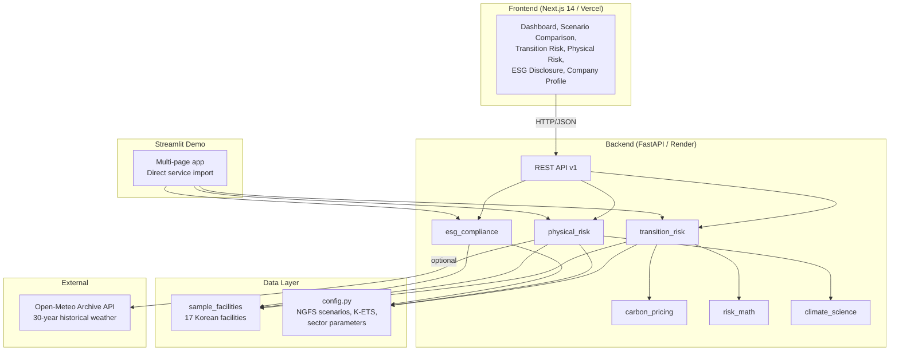

# Climate Risk Analysis Platform

**NGFS scenario-based climate financial risk assessment for Korean industrial facilities**

[](LICENSE)
[](https://fastapi.tiangolo.com)
[](https://nextjs.org)
[](https://python.org)
[]()
[](https://render.com)
[](https://vercel.com)

---

## Overview

The Climate Risk Analysis Platform quantifies climate-related financial risks for 17 Korean industrial facilities across 8 sectors. It evaluates three risk domains -- transition risk (carbon pricing, stranded assets, abatement costs), physical risk (flood, typhoon, heatwave, drought, sea-level rise), and ESG disclosure readiness (TCFD, ISSB, KSSB) -- under four NGFS climate scenarios projected to 2050.

All analytical models are academically grounded (IPCC AR6, Bass 1969 diffusion, Gumbel extreme-value theory, NGFS Phase IV 2023) and parameterized with Korean-specific data from KMA, K-water, and the Korea Exchange (KRX). The platform supports both global carbon pricing (USD) and Korea Emissions Trading Scheme (K-ETS, KRW) pricing regimes.

The system is deployed as three independent layers: a FastAPI backend (Render), a Next.js dashboard (Vercel), and a Streamlit demo app (Streamlit Cloud).

---

## Architecture



| Layer | Technology | Directory | Deployment |
|-------|-----------|-----------|------------|
| Backend API | FastAPI + Pydantic v2 | `backend/` | Render.com |
| Frontend | Next.js 14 + Tailwind CSS | `frontend/` | Vercel |
| Streamlit Demo | Streamlit + Plotly | `streamlit_app/` | Streamlit Cloud |

---

## Key Features

### Transition Risk
- Logistic S-curve emission reduction (Bass 1969 diffusion model) per NGFS scenario
- 8-point NGFS carbon price paths with piecewise linear interpolation (2024-2050)
- K-ETS free allocation with annual tightening by sector
- Stranded asset write-downs for utilities and oil & gas (Carbon Tracker 2023)
- Scope 3 supply-chain exposure (CDP 2023)
- Scenario-adjusted WACC with credit spread overlays (Battiston et al. 2017)
- Sector-specific marginal abatement cost curves with technology learning rates

### Physical Risk
- Gumbel Type I extreme-value flood model (KMA 30-year fit)
- Poisson-distributed typhoon strikes with HAZUS-MH wind damage curves
- Chronic heatwave and drought projections (IPCC AR6 WG1 Ch.11 scaling)
- Sea-level rise (IPCC AR6 WG1 Ch.9)
- USACE depth-damage functions adapted for Korean industrial facilities
- Business interruption modeling (Munich Re / Swiss Re)
- Compound risk aggregation across hazards
- Optional Open-Meteo API integration for location-specific Gumbel parameter derivation

### ESG Disclosure
- TCFD (4 pillars, 11 recommendations), ISSB (IFRS S2), KSSB frameworks
- Maturity-level scoring (1-5 scale) with weighted category aggregation
- Gap analysis with priority rankings
- Regulatory deadline tracking (KSSB mandatory 2025, EU CBAM 2026, KSSB full scope 2027)

### Data Coverage
- 17 Korean industrial facilities across 8 sectors
- 10 sector parameter sets (including real estate and financial services)
- Open-Meteo 30-year historical weather data with 1-hour TTL cache

---

## NGFS Scenarios

| Scenario | Warming Path | Carbon Price 2030 (USD) | Carbon Price 2050 (USD) | Reduction Target |
|----------|-------------|------------------------|------------------------|------------------|
| Net Zero 2050 | 1.5 C | $130 | $250 | 50% |
| Below 2 C | ~2 C | $100 | $200 | 40% |
| Delayed Transition | ~2.5 C (delayed, then sharp) | $90 | $180 | 30% |
| Current Policies | 3 C+ | $40 | $80 | 15% |

K-ETS pricing paths (KRW/tCO2e) are available for all four scenarios via the `pricing_regime=kets` parameter. Free allocation ratios tighten annually per sector (e.g., steel 97% base with 1.0%p/yr reduction).

---

## Quick Start

### Backend

```bash
cd backend
python -m venv venv
source venv/bin/activate        # Windows: venv\Scripts\activate
pip install -r requirements.txt
uvicorn app.main:app --reload
```

Swagger UI available at [http://localhost:8000/docs](http://localhost:8000/docs).

### Frontend

```bash
cd frontend
npm install
```

Create `frontend/.env.local`:

```
NEXT_PUBLIC_API_URL=http://localhost:8000
```

```bash
npm run dev
```

Dashboard available at [http://localhost:3000](http://localhost:3000).

### Streamlit Demo

```bash
cd streamlit_app
pip install -r requirements.txt
streamlit run app.py
```

The Streamlit app imports backend services directly -- no API server required.

---

## API Reference

Base URL: `/api/v1` -- Interactive documentation at `/docs` (Swagger UI).

### Endpoints

| Method | Path | Description | Key Parameters |
|--------|------|-------------|---------------|
| GET | `/api/v1/scenarios` | List all NGFS scenarios | -- |
| GET | `/api/v1/scenarios/{scenario_id}` | Get scenario details | `scenario_id`: path |
| GET | `/api/v1/company/facilities` | List facilities | `sector` (optional) |
| GET | `/api/v1/company/facilities/{facility_id}` | Get facility details | `facility_id`: path |
| GET | `/api/v1/company/sectors` | List available sectors | -- |
| GET | `/api/v1/transition-risk/analysis` | Facility-level transition risk | `scenario`, `pricing_regime` |
| GET | `/api/v1/transition-risk/summary` | Scenario transition summary | `scenario`, `pricing_regime` |
| GET | `/api/v1/transition-risk/comparison` | Cross-scenario comparison | `pricing_regime` |
| GET | `/api/v1/physical-risk/assessment` | Physical risk assessment | `scenario`, `year`, `use_api_data` |
| GET | `/api/v1/esg/assessment` | ESG compliance scoring | `framework` |
| GET | `/api/v1/esg/disclosure-data` | Disclosure detail data | `framework` |
| GET | `/api/v1/esg/frameworks` | List ESG frameworks | -- |
| GET | `/health` | Health check | -- |

### Parameter Reference

| Parameter | Values | Default |
|-----------|--------|---------|
| `scenario` | `net_zero_2050`, `below_2c`, `delayed_transition`, `current_policies` | `net_zero_2050` |
| `pricing_regime` | `global`, `kets` | `global` |
| `framework` | `tcfd`, `issb`, `kssb` | `tcfd` |
| `year` | `2025`-`2100` | scenario default |
| `use_api_data` | `true`, `false` | `false` |

### Example Requests

Transition risk with K-ETS pricing:

```bash
curl "http://localhost:8000/api/v1/transition-risk/analysis?scenario=net_zero_2050&pricing_regime=kets"
```

Physical risk for 2040 with Open-Meteo data:

```bash
curl "http://localhost:8000/api/v1/physical-risk/assessment?scenario=below_2c&year=2040&use_api_data=true"
```

ESG assessment under KSSB framework:

```bash
curl "http://localhost:8000/api/v1/esg/assessment?framework=kssb"
```

---

## Project Structure

```
climate_risk/
├── backend/
│   ├── app/
│   │   ├── main.py                  # FastAPI entry point, CORS, routers
│   │   ├── api/v1/
│   │   │   ├── transition.py        # /transition-risk endpoints
│   │   │   ├── physical.py          # /physical-risk endpoints
│   │   │   ├── esg.py               # /esg endpoints
│   │   │   ├── scenarios.py         # /scenarios endpoints
│   │   │   └── company.py           # /company endpoints
│   │   ├── services/
│   │   │   ├── transition_risk.py   # S-curve, NPV, stranded assets
│   │   │   ├── physical_risk.py     # Gumbel flood, Poisson typhoon, EAL
│   │   │   ├── esg_compliance.py    # TCFD/ISSB/KSSB scoring engine
│   │   │   ├── carbon_pricing.py    # NGFS paths, K-ETS free allocation
│   │   │   ├── risk_math.py         # WACC, NPV, discount rate utilities
│   │   │   ├── climate_science.py   # Warming projections, SLR
│   │   │   └── open_meteo.py        # Historical weather API client
│   │   ├── models/
│   │   │   └── schemas.py           # Pydantic v2 response models
│   │   ├── core/
│   │   │   └── config.py            # Scenarios, sector params, citations
│   │   ├── data/
│   │   │   └── sample_facilities.py # 17 Korean facility records
│   │   └── tests/
│   │       └── test_services.py     # 45 unit tests
│   ├── requirements.txt
│   └── render.yaml                  # Render.com deployment config
├── frontend/
│   ├── src/
│   │   ├── app/                     # Next.js App Router pages
│   │   ├── components/              # Layout, charts, tables, ESG
│   │   ├── lib/                     # API client, utilities
│   │   └── hooks/                   # Data fetching hooks (SWR)
│   ├── package.json
│   └── tailwind.config.ts
├── streamlit_app/
│   ├── app.py                       # Dashboard entry point
│   ├── pages/                       # Multi-page Streamlit views
│   ├── utils/                       # Formatting helpers
│   └── requirements.txt
└── README.md
```

---

## Methodology

| Model | Method | Key Reference |
|-------|--------|--------------|
| Carbon pricing paths | 8-point piecewise linear interpolation | NGFS Phase IV Scenarios (2023) |
| Emission reduction | Logistic S-curve (Bass diffusion) | Bass (1969); calibrated to NGFS |
| Marginal abatement cost | Technology-specific MAC with learning rates | IEA ETP 2023, IRENA 2023 |
| Stranded assets | Annual write-down schedules by sector | Carbon Tracker (2023) |
| WACC adjustment | Base rate + scenario credit spread | Battiston et al. (2017); NGFS 2023 |
| Flood risk | Gumbel Type I extreme-value distribution | KMA 30-year analysis (1991-2020) |
| Typhoon risk | Poisson frequency x HAZUS-MH wind damage | KMA NTC (1951-2023); FEMA HAZUS |
| Depth-damage curves | USACE adapted for Korean industry | Kim & Lee (2019) |
| Heatwave / drought | Linear scaling per degree C of warming | IPCC AR6 WG1 Ch.11; K-water |
| Sea-level rise | IPCC AR6 WG1 Ch.9 projections | IPCC AR6 (2021) |
| ESG scoring | Weighted maturity model (1-5 scale) | TCFD 2017; ISSB IFRS S2; KSSB |

---

## Facility Coverage

| Sector | Count | Example Facilities |
|--------|------:|-------------------|
| Steel | 2 | 포항제철소, 광양제철소 |
| Petrochemical | 2 | 울산석유화학단지, 여수석유화학단지 |
| Automotive | 2 | 울산자동차공장, 아산자동차공장 |
| Electronics | 3 | 화성반도체공장, 평택반도체공장, 구미디스플레이공장 |
| Utilities | 3 | 당진화력발전소, 태안화력발전소, 영흥화력발전소 |
| Cement | 2 | 단양시멘트공장, 영월시멘트공장 |
| Shipping | 1 | 부산항 해운기지 |
| Oil & Gas | 2 | 울산정유공장, 대산정유공장 |
| **Total** | **17** | |

---

## Frontend Pages

| Page | Route | Description |
|------|-------|-------------|
| Dashboard | `/` | KPI cards, facility map, emission overview |
| Company Profile | `/company-profile` | Facility inventory, revenue, emissions by scope |
| Transition Risk | `/transition-risk` | S-curve pathways, cost waterfall, K-ETS toggle |
| Physical Risk | `/physical-risk` | Hazard cards (flood, typhoon, heatwave, drought, SLR), EAL |
| ESG Disclosure | `/esg-disclosure` | Framework scoring, gap analysis, regulatory deadlines |
| Scenario Comparison | `/scenario-comparison` | 4-scenario NPV comparison, risk heatmap |
| Cashflow Impact | `/cashflow-impact` | DCF-based financial impact (planned -- H2 2026) |

---

## Tech Stack

### Backend

| Package | Version | Purpose |
|---------|---------|---------|
| FastAPI | 0.115.0 | REST API framework |
| Pydantic | 2.9.0 | Request/response validation |
| NumPy | 1.26.4 | Numerical computation |
| httpx | 0.27.0 | Async HTTP client (Open-Meteo) |
| uvicorn | 0.30.0 | ASGI server |

### Frontend

| Package | Version | Purpose |
|---------|---------|---------|
| Next.js | 14.2.35 | React framework (App Router) |
| React | 18 | UI library |
| Recharts | 3.7.0 | Chart components |
| SWR | 2.4.0 | Data fetching and caching |
| Tailwind CSS | 3.4.1 | Utility-first CSS |
| Lucide React | 0.569.0 | Icon library |
| TypeScript | 5 | Type safety |

---

## Testing

```bash
cd backend
source venv/bin/activate
pytest app/tests/test_services.py -v
```

45 tests covering: carbon pricing interpolation, K-ETS free allocation, transition risk S-curve, physical risk Gumbel/Poisson models, ESG framework scoring, risk math utilities, and climate science projections.

---

## Deployment

### Backend -- Render.com

The backend deploys as a stateless Python web service. Configuration is defined in `backend/render.yaml`:

- Runtime: Python 3.11
- Build: `pip install -r requirements.txt`
- Start: `uvicorn app.main:app --host 0.0.0.0 --port $PORT`

### Frontend -- Vercel

The Next.js frontend deploys to Vercel with a single environment variable:

- `NEXT_PUBLIC_API_URL` -- points to the Render backend URL

### Streamlit Demo -- Streamlit Cloud

The Streamlit app imports backend services directly via Python (`from app.services...`), requiring no separate API server. Deploy from the `streamlit_app/` directory.

---

## Roadmap

- [x] NGFS 4-scenario transition risk with S-curve reduction
- [x] K-ETS pricing regime with free allocation tightening
- [x] Analytical physical risk model (Gumbel, Poisson, IPCC scaling)
- [x] Open-Meteo historical weather integration
- [x] ESG disclosure engine (TCFD / ISSB / KSSB)
- [x] Next.js dashboard with interactive charts
- [ ] DCF cashflow impact analysis (H2 2026)
- [ ] PDF report generation
- [ ] Multi-company portfolio mode
- [ ] EU ETS / CBAM cross-border pricing
- [ ] Docker Compose for local development

---

## License

This project is licensed under the GNU General Public License v3.0 -- see the [LICENSE](LICENSE) file for details.

---

## Acknowledgments

- [NGFS](https://www.ngfs.net/) -- Network for Greening the Financial System scenario framework
- [IPCC AR6](https://www.ipcc.ch/assessment-report/ar6/) -- Physical science basis for climate projections
- [KMA](https://www.kma.go.kr/) -- Korea Meteorological Administration historical climate data
- [Carbon Tracker Initiative](https://carbontracker.org/) -- Stranded asset analysis methodology
- [CDP](https://www.cdp.net/) -- Scope 3 supply-chain emission exposure data
- [IEA](https://www.iea.org/) / [IRENA](https://www.irena.org/) / [IMO](https://www.imo.org/) -- Sector abatement technology references
- [Open-Meteo](https://open-meteo.com/) -- Historical weather archive API
