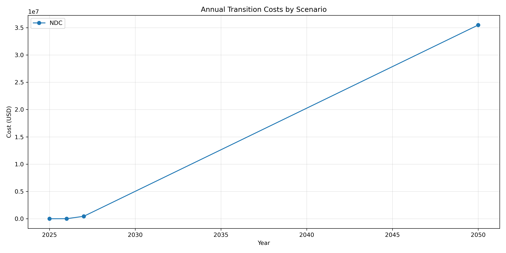
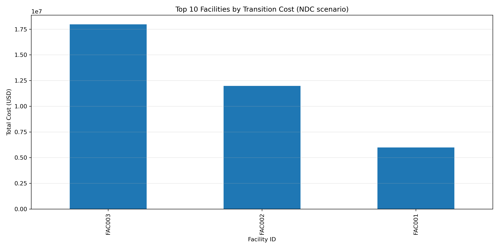
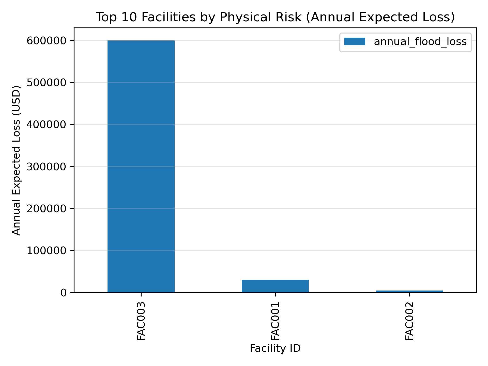

# Climate Financial Risk Report

## Executive Summary

### Transition Risk

| Scenario | Total Cost ($) | Avg Annual Cost ($) | Max Annual Cost ($) | Max Cost Year |
|----------|---------------|---------------------|---------------------|--------------|
| NDC | 35,936,438.11 | 8,984,109.53 | 35,483,726.11 | 2050 |

### Physical Risk

| Scenario | Total Annual Loss ($) | Avg Facility Loss ($) | Max Facility Loss ($) |
|----------|---------------------|----------------------|----------------------|
| base | 635,000.00 | 211,666.67 | 600,000.00 |

## Key Visualizations

### Transition Risk Over Time

### Top Facilities by Transition Risk

### Top Facilities by Physical Risk

## Detailed Analysis

### Transition Risk Detailed Analysis

#### NDC Scenario

- Total cost across all facilities: $35,936,438.11
- Average annual cost: $8,984,109.53
- Highest annual cost: $35,483,726.11 in 2050

##### Cost Evolution

| Year | Annual Cost ($) |
|------|----------------|
| 2025 | 0.00 |
| 2026 | 7,680.00 |
| 2027 | 445,032.00 |
| 2050 | 35,483,726.11 |

### Physical Risk Detailed Analysis

#### base Scenario

- Total annual expected loss: $635,000.00
- Average loss per facility: $211,666.67
- Maximum facility loss: $600,000.00

