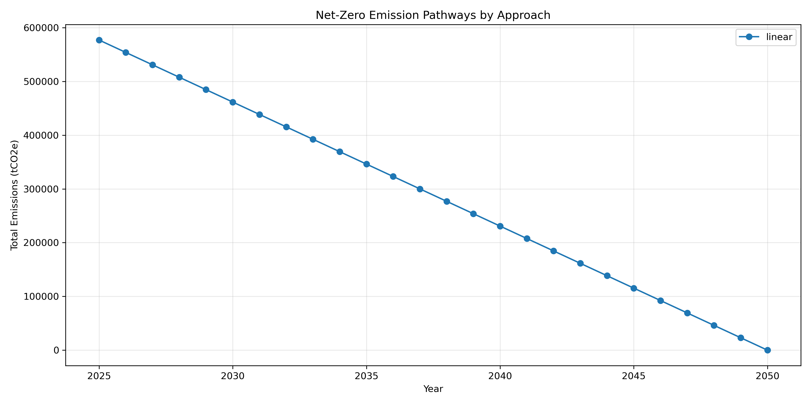

# Net-Zero Pathway and Climate Value at Risk Report

## Executive Summary

### Net-Zero Pathways

| Approach | Initial Emissions (tCO2e) | Final Emissions (tCO2e) | Reduction (%) |
|----------|---------------------------|-------------------------|--------------|
| linear | 576,923.08 | 0.00 | 100.0% |

## Key Visualizations

### Emission Reduction Pathways

## Detailed Analysis

### Net-Zero Pathway Detailed Analysis

#### linear Approach

- Initial emissions (2025): 576,923.08 tCO2e
- Final emissions (2050): 0.00 tCO2e
- Total reduction: 576,923.08 tCO2e (100.0%)

##### Emissions Trajectory

| Year | Target Emissions (tCO2e) |
|------|--------------------------|
| 2025 | 576,923.08 |
| 2026 | 553,846.15 |
| 2027 | 530,769.23 |
| 2028 | 507,692.31 |
| 2029 | 484,615.38 |
| 2030 | 461,538.46 |
| 2031 | 438,461.54 |
| 2032 | 415,384.62 |
| 2033 | 392,307.69 |
| 2034 | 369,230.77 |
| 2035 | 346,153.85 |
| 2036 | 323,076.92 |
| 2037 | 300,000.00 |
| 2038 | 276,923.08 |
| 2039 | 253,846.15 |
| 2040 | 230,769.23 |
| 2041 | 207,692.31 |
| 2042 | 184,615.38 |
| 2043 | 161,538.46 |
| 2044 | 138,461.54 |
| 2045 | 115,384.62 |
| 2046 | 92,307.69 |
| 2047 | 69,230.77 |
| 2048 | 46,153.85 |
| 2049 | 23,076.92 |
| 2050 | 0.00 |

